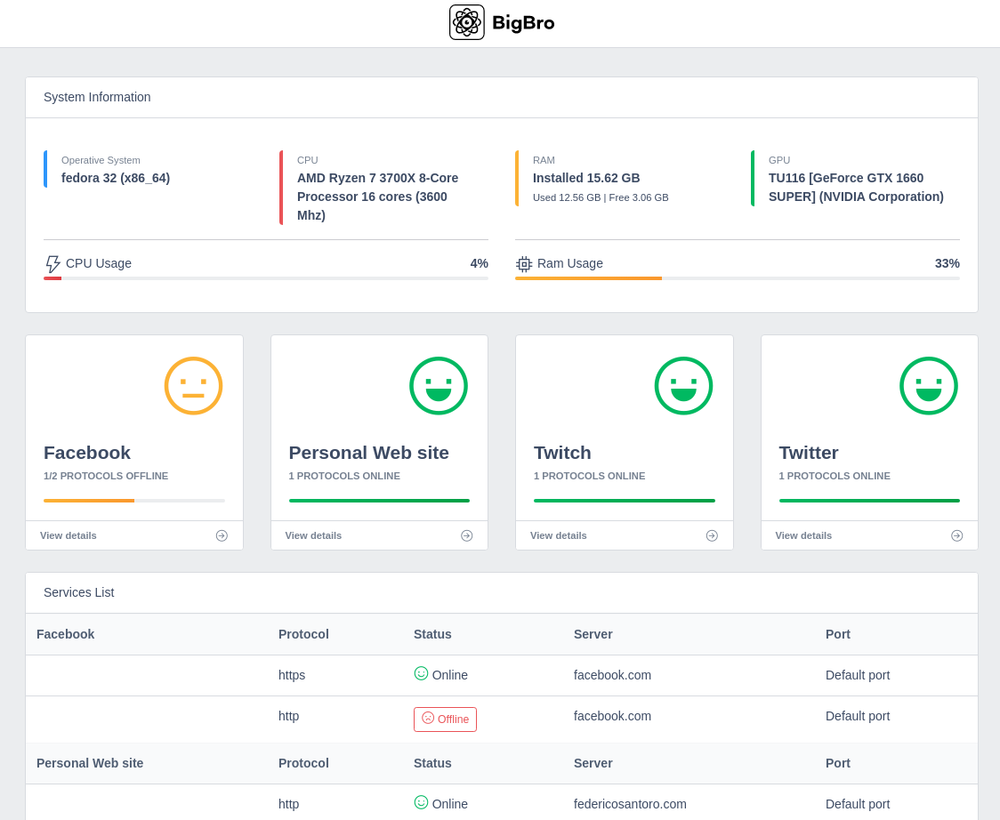
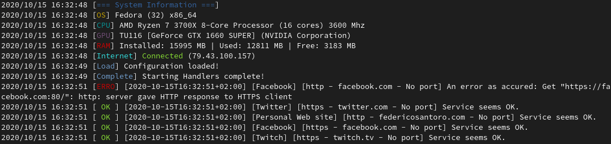

# BigBro 
[](https://travis-ci.org/bigbroproject/bigbrocore) [](https://https://github.com/bigbroproject/bigbrocore/master/LICENSE)
[](https://golang.org)
[](https://https://v3.vuejs.org/)
[](https://github.com/bigbroproject/bigbrocore)
[]()  

An extensible monitoring tool for user defined services and protocols, all wrote in GoLang and UI with VueJS 3 made with [BigBro core](http://github.com/bigbroproject/bigbrocore).

### Project status
* This project is in **BETA stage**
* Go version : **1.15**
* BigBro core version: []()  

## Introduction

BigBro is a lightweight monitoring software tool that offers a lightweight User Interface to monitor the services and protocols defined by users.



The software also can be used only via CLI interface



The antire software is based on one configuration file where it is possible define a list of services that would be monitor.

## Compatibility

### Operative Systems
BigBro was compiled and test on Debian and RHEL Linux distribution families.

### Hardware
BigBro was develop to run in any kind of computer or embedded system and was tested on:

- General Personal Computer (x86_64)
- Raspberry 3 B+
- Orange Pi Zero

## Defaults Protocols implemented
The default protocols are based on default protocols from BigBro Core, nevertheless new or custom protocols can be implemeted in BigBro as in BigBro Core.
- http
- https (with ssl)
- icmp
- icmp6

## Configuration file
In the configuration file will must be defined all services and protocol to be monitor. The format type of the file is YAML as follows:

```yaml
services:
  - name: Facebook (ssl)
    protocols:
      - type: https
        port: 443
        server: facebook.com
        interval : 1000
  - name: Google
    protocols:
      - type: http
        server: google.com
        interval : 1000
  - name: Google DNS
    protocols:
      - type: icmp
        server: 8.8.8.8
        interval : 1000
  - name: Google DNS6
    protocols:
      - type: icmp6
        server: 2a00:1450:400a:804::2004
        interval : 5000
      - type: ftp
        server: 1.1.1.1
        interval : 1000
        customs :
          user : uss
          password : passwd
  ...
```
* `name` : Name of the service
* `protocols`: List of protocols that would be monitored
    * `type`: name of registered protocol
    * `server`: IP or dns of service
    * `interval`: interval time between check (in milliseconds)
    * `port`: (optional) port of service
    * `customs`: (optional) list of custom filed for custom implementation of protocols


## Usage Example
### From Binary File
Basically BigBro can be downloaded from releases section with a pre-compiled binary file.

[Releases Page](https://github.com/bigbroproject/bigbro/releases) | Last release:

[]()  

### From Source Code

#### Requirements
- NodeJS >= v12.10.1 (it is used to compile the user interface)
- Go Version >= v1.15 (developed with this version)
- Git installed
- Linux Debian or RHEL distribution

Firstly, before the usage of this library you must clone this repository:
```bash
git clone github.com/bigbroproject/bigbro
```

Secondly, the installation of libraries and dependencies is required:
```bash
cd bigbro && make install-dep
```
After the installation of dependencies, you can proceed to build BigBro:

```bash
make build
```
If there are any errors you can find the built solution into the new dir bin or you can install automatically the solution in your system with install command (BigBro will be installed in your home):

```bash
make install
```


#### Customisation of the code
Before the build phse you can edit the main code, registering new protocols or handlers:

```go
package main

import (
	"github.com/bigbroproject/bigbrocore/core"
	"github.com/bigbroproject/bigbrocore/protocols"
	"github.com/bigbroproject/bigbrocore/responsehandlers"
)

func main() {


	//log.SetFlags(log.LstdFlags | log.Lshortfile)
	system.PrintSystemInfo()
	ws := webserver.NewWebServer("config/serverconfig.yml")
	ws.Start()

	regProtocolInterfaces, regResponseHandlerInterfaces := core.Initialize("config/config.yml")

	// Register custom protocols
	//protocols.RegisterProtocolInterface(&regProtocolInterfaces, "ftp", protocols.FTP{})

	// Register Response Handlers
	responsehandlers.RegisterResponseHandlerInterface(&regResponseHandlerInterfaces, "webServerHandler", responsehandler.WebServerRespHandler{OutputChannel: ws.InputChannel})

    // Register custom handlers
	//responsehandlers.RegisterResponseHandlerInterface(&regResponseHandlerInterfaces, "console", responsehandlers.ConsoleHandler{})
	responsehandlers.RegisterResponseHandlerInterface(&regResponseHandlerInterfaces, "consoleMemory", responsehandlers.ConsoleHandlerWithMemory{})

	// Start monitoring
	core.Start(regProtocolInterfaces, regResponseHandlerInterfaces)

}
```
In this example we `Initialize` the entire module with a given configuration file path (you can mange this as a first input in your command line, for instance). 
Secondly, you must define and register a ResponseHandler to manage the Responses from service checks (otherwise you cannot log or see anything) and then register a custom protocol, if needed.

Finally, you can over your project main with the `Start` of the module. 

## Struct of the Core and implementation of custom protocols and handlers

BigBro core structured in two main parts: `protocolInterface` and `responseHandlerInterface`. 
### protocolInterface
BigBro allows the implementation of new type of network protocol or services to be monitor. To develop an implementation the developer must implements the `protocolInterface`, in particular the developer must implement the `CheckService` function, and the struct that defines the protocol or service.

In the `CheckService` function must be defined the check login of the specified protocol / service and then return the `error` (if occurred) or `nil`. 

An example of implementation of a http protocol:

```go
package protocols

import (
	"github.com/bigbroproject/bigbrocore/models"
	httplib "net/http"
	"strconv"
	"time"
)

type Http struct {
}

// If error is nil, then service is up
func (http Http) CheckService(Protocol models.Protocol) error {
	// CHECK
	tr := &httplib.Transport{
		MaxIdleConns:    10,
		IdleConnTimeout: 30 * time.Second,
	}
	client := &httplib.Client{Transport: tr}
	url := "http://" + Protocol.Server
	if Protocol.Port == 0 {
		url += ":80"
	} else {
		url += ":" + strconv.Itoa(Protocol.Port)
	}
	_, err := client.Get(url)
	return err
}
```

In this example the `CheckService` try to perform a simply GET via http to the specific server or service and then return the http error if occurred, `nil` otherwise.


### responseHandlerInterface
A responseHandlers receives the responses (the responses are define by the `models/response/Response` struct) from the monitoring process, defined by the config files and registered protocols. 

A struct that defines the handler and a `Handle` function must be implemented to mange the received `Response` from the monitoring processes. It must had an infinite loop to manage the receiving Responses.

A response is structured as follow:
```go
type ResponseType string

const (
	Success ResponseType = "Success"
	Error                = "Error"
)

type Response struct {
	ServiceName  string          // The service name defined in configuration file
	Protocol     models.Protocol // The protocol used to monitoring defined in configuration file
	ResponseType ResponseType    // The ReponseType (Success or Error)
	Error error                  // The error if there is any
}
```

The channel which is passed as input in `Handle` function is used where the responses arrive.

Following, an example of `ConsoleHandler`, that simply prints the `Responses` in console:

```go
package responsehandlers

import (
	"fmt"
	"github.com/bigbroproject/bigbrocore/models/response"
	"github.com/fatih/color"
	"log"
	"strconv"
	"time"
)

type ConsoleHandler struct {}

/*
    Handle - manage the responses
    configuration - is the same configuration model loaded from configFile
    channel - is the channel where responses arrive from check processes 
*/
func ( handler ConsoleHandler) Handle(configuration *models.Config, channel *chan response.Response){
    for  { //the infinite loop
	resp := <- *channel // the receiving response
	if resp.ResponseType == response.Error {
            message = fmt.Sprintf("[%s] [%s] [%s] [%s - %s - %s] An error as accured: %s", "ERRO", now.Format(time.RFC3339), resp.ServiceName, resp.Protocol.Type, resp.Protocol.Server, port, resp.Error.Error())
        } else {
            message = fmt.Sprintf("[ %s ] [%s] [%s] [%s - %s - %s] Service seems OK.", "OK", now.Format(time.RFC3339), resp.ServiceName, resp.Protocol.Type, resp.Protocol.Server, port)
        }
        log.Println(message)
    }
}
```


---
Made with ❤️ by [filirnd](http://github.com/filirnd) and [fedyfausto](http://github.com/fedyfausto), logo by Asdrubbalo


